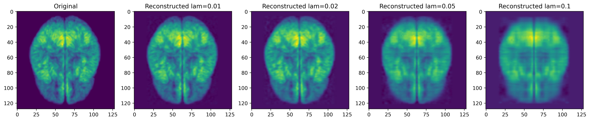

# MRI Dictionary Learning

## Author
Ronen Huang

## Timeline
April 2025 to May 2025

## Pipeline
1. Resize 121 x 145 x 121 MRI images to 128 x 128.
2. Concatenate 10 images side by side to create $\bm{Y} \in \mathbb{R}^{128 \times 1280}$ data matrix.
3. Solve $\min_{\bm{q}} \frac{1}{m}\|\bm{q}^T\bm{Y}\|_1$ such that $\|\bm{q}\|_2 = 1$ with $R = 128 \log (128)$ rounds to create orthogonal dictionary $\bm{A} = \{\bm{a}_1, \cdots, \bm{a}_n\} \in O(n)$.
4. Solve $\min_{\bm{A}, \bm{X}} \frac{1}{2}\|\bm{Y} - \bm{A}\bm{X}\|_F^2 + \lambda \|\bm{X}\|_1$ such that $\bm{A} \in O(n)$.

The implementation can be see in [**dictionary_learning.ipynb**](dictionary_learning.ipynb).

